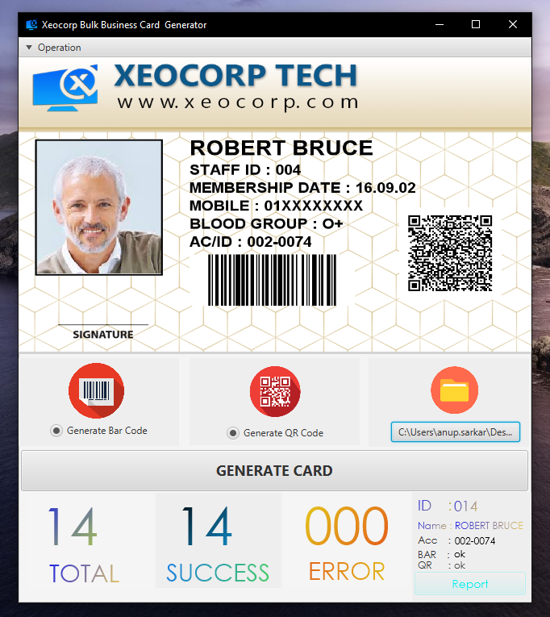
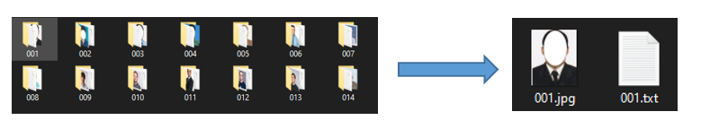
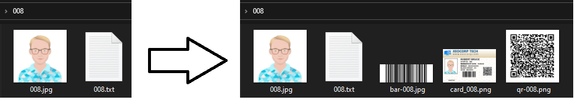

 # XEOCORP Bulk Business Card Generator with QR Code

  

 

## Generate Bulk/Multiple Business Card by reading files from folder.**

## Features:

1. Read User wise data from folder.
2. Populate business card along with Bar Code &amp; QR Code for each user.
3. Save business card for each user&#39;s folder for print.
4. Live monitoring the card generation process
5. Photoshop PSD template is also given so that you can create your own business card template.
6. Faster card generation &amp; report

## Requirements:

1. User wise Folder Name should be unique. Inside the user folder must contain 2 more file(user image,info) with same name. For example , Folder &quot;001&quot; -\&gt; Files (001.jpg and 001.txt )

1. Card Template size must be 900 X 574

## Technology Used :

1. Java
2. JavaFx
3. Google zxing Bar/Qr Code Generator

## Output :

   
  
## Video Tutorial
### https://www.youtube.com/watch?v=VVlrRC3KttA&t=23s
